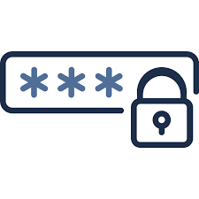

# UserAuthentificationController




User authentification controller have five main functionalities: sign-up, login, logout, change password and delete user.
Usernames and passwords are stored in hash table, which allows us quick efficient search O(1). The program also keeps users' old passwords and does not allow users to change password to the old one.

## Getting Started

These instructions will get you a copy of the project up and running on your local machine for development and testing purposes.

### Prerequisites

What things you need to install:

* Visual Studio Code for C++ development (or any other IDE) - https://code.visualstudio.com/download


### Installing

* Clone this repository to your machine
```
git clone https://github.com/VeronikaDmytryk/UserAuthentificationController.git
```

* Add the UserAuthentificationController folder for your workspace in Visual Studio Code
(File->Add folder to workspace)
* Navigate to the folder in your VSC terminal

## Built With
* Press Ctrl+Shift+B - for compiling the project
* Run the ./client.exe command in your VSC terminal

## Authors

* **Veronika Dmytryk** - [VeronikaDmytryk](https://github.com/VeronikaDmytryk)

## License

This project is licensed under the MIT License - see the [LICENSE.md](LICENSE) file for details
